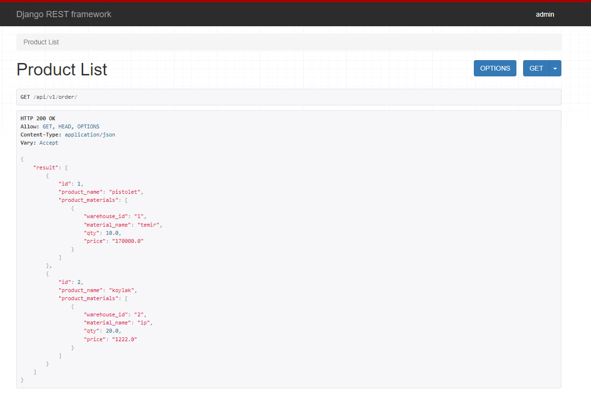
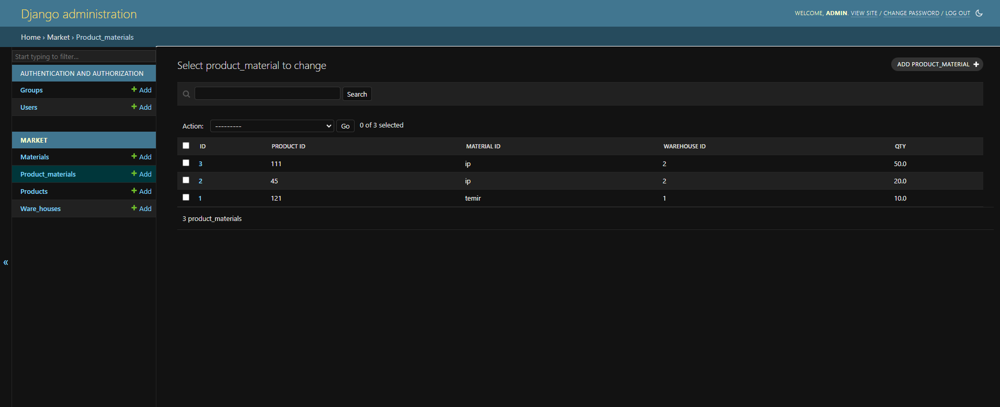

# Test task project
- This project was created to demonstrate possible test tasks for interviews
- Author: [WrldEngine](https://github.com/WrldEngine)

## Deployment
1. Setup [poetry](https://pypi.org/project/poetry/) and install requirements (`poetry install`)
2. Rename `.env.dist` to `.env` and configure it
3. Run virtual env with `poetry shell` command
4. Run database migrations with `python3 manage.py migrate` command
5. Run `python3 manage.py createsuperuser` to create superuser
6. Run server (`python3 manage.py runserver`)

## Development
**Make migration script:**

    python3 manage.py makemigrations

**Run migrations:**

    python3 manage.py migrate

## Demonstration

## Used technologies

- [Django Rest Framework](https://www.django-rest-framework.org/)
- [PostgreSQL](https://www.postgresql.org/) (database)
